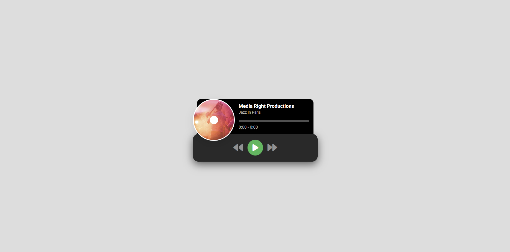

<h1 align="center"> Mini Music Player </h1>

Este projeto foi desenvolvido atravez de um tutorial do ASMR Programming, em sua série 100 dias de código.  
<a href="https://www.youtube.com/watch?v=SAzB_M2wpR0">Estude esse projeto em formato de vídeo clicando aqui.</a>

  <a href="#-tecnologias">Tecnologias</a>&nbsp;&nbsp;&nbsp;|&nbsp;&nbsp;&nbsp;
  <a href="#-projeto">Projeto</a>&nbsp;&nbsp;&nbsp;|&nbsp;&nbsp;&nbsp;
  <a href="#memo-licença">Licença</a>

 

  

## 🚀 Tecnologias

Esse projeto foi desenvolvido com as seguintes tecnologias:

- HTML e CSS
- JavaScript
- Git e Github

## 💻 Projeto

O Mini Music Player como o próprio nome ja diz, trata-se de um Mini reprodutor de músicas.

- [Acesse o projeto finalizado, online](https://juandasilvaa.github.io/Mini-Music-Player/)

- [Assistir ao tutorial](https://www.youtube.com/watch?v=SAzB_M2wpR0)

## :memo: Licença

Esse projeto foi feito pelo @AsmrProg-YT.
Para acessar mai conteudos do @AsmrProg-YT [clique aqui.](https://www.youtube.com/@AsmrProg)
